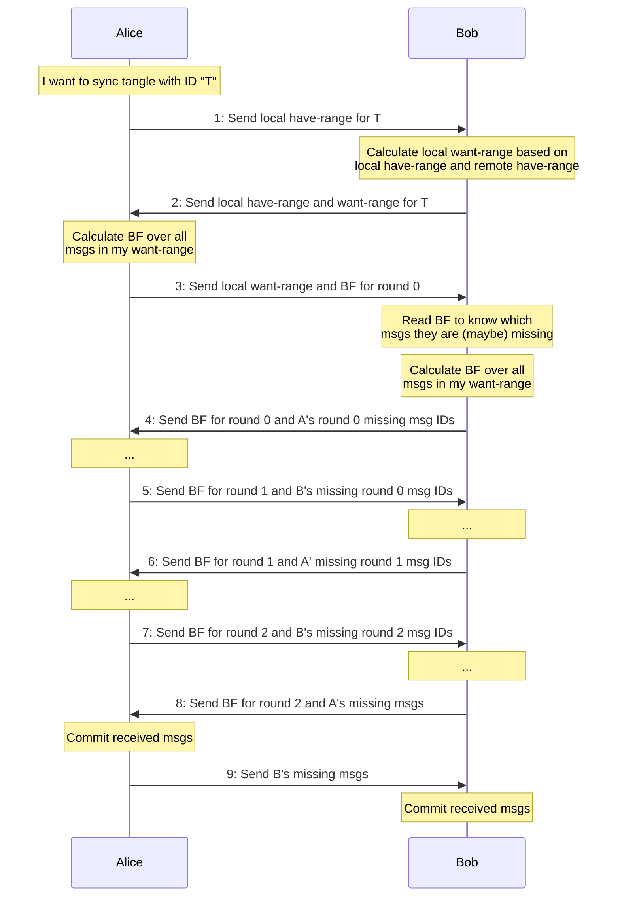

The bloom filter is a representation of msgs I already have in my want-range,
so you know you can (probably?) skip sending them to me.

The "probably?" uncertainty is reduced by doing several rounds.




Peers exchange

```typescript
type Range = [number, number]

interface WithId {
  /** TangleID: msg hash of the tangle's root msg */
  id: string,
}

interface Data1 extends WithId {
  phase: 1,
  payload: Range,
}

interface Data2 extends WithId {
  phase: 2,
  payload: {
    haveRange: Range,
    wantRange: Range,
  }
}

interface Data3 extends WithId {
  phase: 3,
  payload: {
    wantRange: Range,
    bloom: string, // "bloom-filters" specific format TODO: generalize
  }
}

interface Data4567 extends WithId {
  phase: 4 | 5 | 6 | 7,
  payload: {
    msgIDs: Array<string>,
    bloom: string, // "bloom-filters" specific format TODO: generalize
  }
}

interface Data8 extends WithId {
  phase: 8,
  payload: {
    msgs: Array<Msg>,
    bloom: string,
  }
}

interface Data9 extends WithId {
  phase: 9,
  payload: Array<Msg>,
}

type Data = Data1 | Data2 | Data3 | Data4567 | Data8 | Data9
```