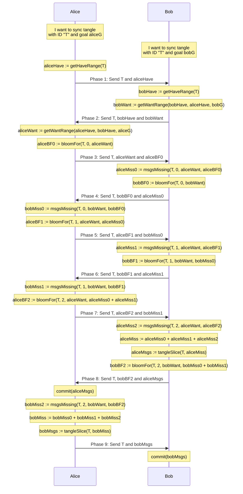

The bloom filter is a representation of msgs I already have in my want-range,
so you know you can (probably?) skip sending them to me.

The "probably?" uncertainty is reduced by doing several rounds.




Methods:

```
/**
 * Determines the range of depths of msgs I have in the tangle
 */
getHaveRange(tangleID) -> [minDepth, maxDepth]
```

```
/**
 * Determines the range of depths of (new) msgs I want from the tangle
 */
getWantRange(localHaveRange, remoteHaveRange, goal) -> [minDepth, maxDepth]
```

```
/**
 * Creates a serialized bloom filter containing the identifiers `${round}${msgID}` for:
 * - Each msg in the tangle `tangleID` within depth `range` (inclusive)
 * - Each "ghost" msg ID for this tangle
 * - Each "extra" msg ID from `extraMsgIDs`
 */
bloomFor(tangleId, round, range, extraMsgIDs) -> Bloom
```

```
/**
 * Returns the msg IDs in the tangle `tangleID` which satisfy:
 * - `msg.metadata.tangles[tangleID].depth` within `range` (inclusive)
 * - `${round}${msgID}` not in `bloom`
 */
msgsMissing(tangleID, round, range, bloom) -> Array<MsgID>
```

```
/**
 * Identifies the lowest depth msg in `msgID` as "lowest" and then returns an
 * Array of msgs with:
 * - `lowest`
 * - msgs posterior to `lowest`
 * - trail from `lowest` to the root
 * The Array is topologically sorted.
 */
tangleSlice(tangleID, msgIDs) -> Array<Msg>
```

```
/**
 * Receives an Array of PPPPP msgs, validates and persists each in the database.
 */
commit(msgs) -> void
```

Peers exchange

```typescript
type Range = [number, number]

interface WithId {
  /** TangleID: msg hash of the tangle's root msg */
  id: string,
}

interface Data1 extends WithId {
  phase: 1,
  payload: Range,
}

interface Data2 extends WithId {
  phase: 2,
  payload: {
    haveRange: Range,
    wantRange: Range,
  }
}

interface Data3 extends WithId {
  phase: 3,
  payload: {
    wantRange: Range,
    bloom: string, // "bloom-filters" specific format TODO: generalize
  }
}

interface Data4567 extends WithId {
  phase: 4 | 5 | 6 | 7,
  payload: {
    msgIDs: Array<string>,
    bloom: string, // "bloom-filters" specific format TODO: generalize
  }
}

interface Data8 extends WithId {
  phase: 8,
  payload: {
    msgs: Array<Msg>,
    bloom: string,
  }
}

interface Data9 extends WithId {
  phase: 9,
  payload: Array<Msg>,
}

type Data = Data1 | Data2 | Data3 | Data4567 | Data8 | Data9
```